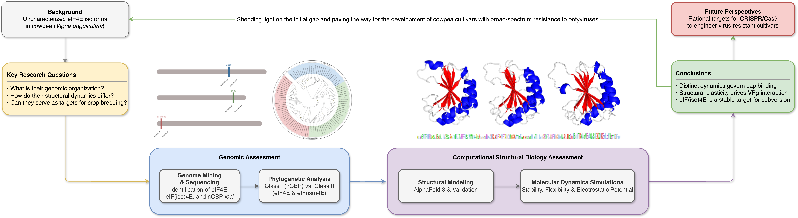

# Unveiling Three Functionally Diverse Isoforms of eIF4E in Cowpea Through a Multi-Omics Approach





Repository for the datasets, structural models, analysis outputs, and computational workflows associated with the manuscript:

```text
Luna-Aragão, M. A. de, Andrade, F. A. de, Penna, S. R. M., Maciel, L. S., Rodrigues-Paixão, L. M., Lemos, A. B., Ferreira, J. D. C., Aragão, F. J. L., Pandolfi, V., & Benko-Iseppon, A. M. (2025). Unveiling Three Functionally Diverse Isoforms of eIF4E in Cowpea Through a Multi-Omics Approach. Agronomy, 15, xxx. https://doi.org/10.3390/xxxxx
```

## Repository contents

This repository is organized to separate raw data, processed outputs, structural files, and executable workflows.

```text
.
├── README.md
├── LICENSE
└── data/
    ├── raw/
    │   ├── primer-sequences/
    │   └── sequencing-outputs/
    └── processed/
        ├── alignments/
        ├── aminoacid-sequences/
        ├── cds-sequences/
        ├── phylogeny/
        ├── synteny/
        └── theorical-models/
```

## Overview

The eukaryotic translation initiation factor 4E (eIF4E) family plays a central role in cap-dependent translation and is also recurrently associated with susceptibility or resistance to potyviruses in plants. In cowpea (*Vigna unguiculata*), this repository documents a multi-omics and structural bioinformatics investigation of three cap-binding protein isoforms:

- **eIF4E**
- **eIF(iso)4E**
- **nCBP**

The study integrates sequence mining, chromosomal mapping, gene structure inspection, synteny analysis, phylogenetic reconstruction, structural modeling, model validation, molecular dynamics simulations, and electrostatic surface analysis to characterize these isoforms at genomic, evolutionary, and structural levels.

## Study rationale

Cowpea is an agronomically important legume and a major crop in several regions of the world. Members of the eIF4E family are biologically relevant because they simultaneously:

- Regulate cap-dependent protein synthesis
- Participate in RNA metabolism
- May act as host susceptibility factors exploited by potyviruses such as CABMV

Despite the relevance of these proteins, the structural determinants and evolutionary organization of the cowpea eIF4E family were still insufficiently characterized. This repository addresses that gap by providing data and analyses for the three identified cowpea isoforms.

## Main findings

The study supports the following main conclusions:

1. **Three paralogous eIF4E-family genes were identified in cowpea**, corresponding to **nCBP**, **eIF4E**, and **eIF(iso)4E**.
2. These genes are located on **chromosomes 4, 6, and 7**, respectively.
3. The family shows **high synteny with *Phaseolus vulgaris*** and a genomic organization compatible with **dispersed duplication events**.
4. Phylogenetic analyses support the evolutionary separation of **nCBP** from the canonical **eIF4E / eIF(iso)4E** lineages.
5. All modeled proteins preserve the **canonical “cupped hand” fold** characteristic of eIF4E-family cap-binding proteins.
6. Molecular dynamics analyses indicate overall structural stability for all isoforms across simulated systems.
7. **eIF(iso)4E** showed the strongest signature of **compactness and structural stability**, making it a particularly relevant target for future functional and applied studies.
8. Electrostatic surface analyses revealed a **conserved electropositive cap-binding cleft**, consistent with functional competence for mRNA cap recognition.
